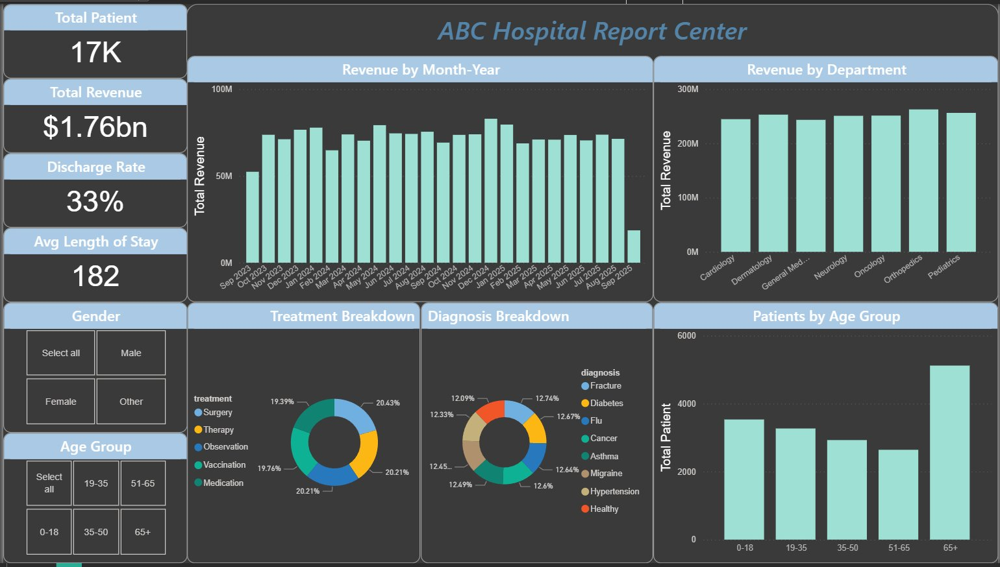

# ABC Hospital Report Center

**End-to-end BI pipeline built entirely in Microsoft Fabric**

A full portfolio project covering every layer of the modern Microsoft Fabric stack: raw data ingestion through Dataflow Gen2, Delta Lake storage in OneLake, Direct Lake semantic modeling, DAX measure development, and a published Power BI dashboard.

---

## Project Summary

| | |
|---|---|
| **Primary Goal** | Demonstrate end-to-end Microsoft Fabric pipeline development |
| **Dataset** | 17,489 patient records, 14 columns (admissions, diagnoses, treatments, billing) |
| **Stack** | Microsoft Fabric, Dataflow Gen2, OneLake, Delta Lake, Direct Lake, DAX, Power Query (M), Spark SQL, Power BI |
| **Status** | Complete - published to Fabric Default workspace |

---

## Business Questions the Dashboard Answers

- What is total revenue, and how has it trended over time?
- Which hospital departments generate the most revenue?
- What is the average length of stay and discharge rate?
- How are patients distributed across age groups, diagnoses, and treatments?

---

## Architecture

```
Raw CSV (public GitHub repository)
        |
        v
Dataflow Gen2 - Healthcare_Dataflow
(Power Query in Fabric: data typing, column cleanup, Age Group column, Calendar table)
        |
        v
Delta Tables in OneLake - Healthcare_LH (dbo/Tables)
    - healthcare_data
    - Calendar
        |
        v
Direct Lake Semantic Model - Healthcare_SM
(DAX measures, relationships, Sort by Column settings)
        |
        v
Live Connection - Power BI Desktop
        |
        v
Published Report - ABC Hospital Report Center (Default Workspace)
```

**Core architectural principle:** Every transformation happens as early in the pipeline as possible. The Age Group bucketing column and the Calendar date table both live in Dataflow Gen2, not in the semantic model. This is required because Direct Lake has a hard constraint: calculated tables in the semantic model cannot reference Direct Lake tables. The semantic model is intentionally thin - relationships, DAX measures, and sort settings only.

---

## What Was Built

### 1. Lakehouse (Healthcare_LH)
- Created in Fabric Default workspace with schema support enabled at creation
- Schema support is required for Dataflow Gen2 to register tables under `dbo/Tables` in the metastore. Without it, Delta files land as unregistered Parquet files.

### 2. Dataflow Gen2 (Healthcare_Dataflow)
- Connected to the dataset via raw GitHub URL (workaround for OneDrive connector limitation in Fabric trial)
- Removed PII columns (`phone`, `email`) - not needed for analysis
- Set correct data types: `admission_date` and `discharge_date` as Date, `bill_amount` as Decimal, `age` as Integer
- Added `Age Group` calculated column using nested if/then/else M syntax
- Added `Calendar` as a second blank query using M code, generating a dynamic date range from min admission date to max discharge date
- Published both tables to `Healthcare_LH`

### 3. Delta Tables in OneLake
- `healthcare_data` and `Calendar` both registered under `Healthcare_LH > Tables > dbo`
- Change Data Feed (CDF) enabled on both tables via Spark SQL Notebook - required for the Direct Lake semantic model to reliably detect and register tables
- `Year-Month Sort` column added to Calendar via Notebook (Dataflow schema update did not propagate automatically)

```python
spark.sql("ALTER TABLE dbo.healthcare_data SET TBLPROPERTIES ('delta.enableChangeDataFeed' = 'true')")
spark.sql("ALTER TABLE dbo.Calendar SET TBLPROPERTIES ('delta.enableChangeDataFeed' = 'true')")

spark.sql("ALTER TABLE dbo.Calendar ADD COLUMN `Year-Month Sort` BIGINT")
spark.sql("UPDATE dbo.Calendar SET `Year-Month Sort` = YEAR(Date) * 100 + MONTH(Date)")
```

### 4. Semantic Model (Healthcare_SM)
- Created from inside Healthcare_LH using the "New semantic model" button
- Tables added via "Edit tables" in the ribbon after CDF was enabled
- Relationship: `Calendar[Date]` to `healthcare_data[admission_date]` (one-to-many, single cross-filter)
- `Month-Year` column Sort by Column set to `Year-Month Sort`
- All 4 DAX measures in a dedicated `_measures` table

### 5. DAX Measures

```dax
Total Patient =
DISTINCTCOUNT(healthcare_data[patient_id])

Total Revenue =
SUM(healthcare_data[bill_amount])

Avg Length of Stay =
AVERAGEX(
    healthcare_data,
    DATEDIFF(healthcare_data[admission_date], healthcare_data[discharge_date], DAY)
)

Discharge Rate =
DIVIDE(
    CALCULATE(COUNTROWS(healthcare_data), FILTER(healthcare_data, healthcare_data[status] = "Discharged")),
    COUNTROWS(healthcare_data)
)
```

### 6. Power BI Dashboard
- Connected via Live Connection to `Healthcare_SM` in Power BI Desktop
- Live Connection = read-only consumer of the shared semantic model. No local data copy, no local schema changes. All model changes propagate automatically to connected reports.
- Published to Default workspace as "ABC Hospital Report Center"

---

## Dashboard Visuals

| Visual | Type |
|---|---|
| Total Patient | KPI Card |
| Total Revenue | KPI Card |
| Discharge Rate | KPI Card |
| Avg Length of Stay | KPI Card |
| Revenue by Month-Year | Bar chart (sorted by Year-Month Sort) |
| Revenue by Department | Bar chart |
| Treatment Breakdown | Donut chart (5 categories) |
| Diagnosis Breakdown | Donut chart (8 categories) |
| Patients by Age Group | Bar chart (0-18, 19-35, 35-50, 51-65, 65+) |
| Gender | Slicer |
| Age Group | Slicer |



---

## Fabric Trial Limitations and Workarounds

Working in the Fabric free trial surfaces real architectural constraints. These are documented as interview talking points, not gaps.

| Limitation | Workaround |
|---|---|
| Semantic model workspace dropdown only shows Default | Move all items (Lakehouse, Dataflow, Semantic model) into Default workspace - architecturally correct anyway |
| Calculated tables cannot reference Direct Lake tables | Build Calendar as a Dataflow Gen2 query, land as a Delta table, add to model via "Edit tables" |
| New Dataflow columns do not propagate automatically | Use "Edit tables" in ribbon for schema refresh; use Notebook ALTER TABLE for columns Dataflow cannot land |
| CDF required for semantic model table registration | Enable via Notebook: `ALTER TABLE ... SET TBLPROPERTIES ('delta.enableChangeDataFeed' = 'true')` |
| OneDrive connector not available in trial | Upload CSV to public GitHub repository, connect via raw URL |
| Semantic model not available as a standalone catalog item | Create only from inside the Lakehouse using the "New semantic model" ribbon button |

---

## Key Concepts Demonstrated

**Direct Lake vs Import vs DirectQuery**
- Import copies data into the model's in-memory cache. Fast queries, stale between refreshes.
- DirectQuery fires a live query to the source on every visual. Always current, but slower.
- Direct Lake reads Parquet files directly from OneLake. No data copy, no live query overhead. Import-level speed, near-real-time freshness. Only available in Microsoft Fabric.

**Dataflow Gen2 vs SSIS**
Dataflow Gen2 is Power Query in the cloud - same M language, same transformation interface. The difference is the destination: instead of loading into a local Power BI model, it lands data into OneLake as a Delta table. Cloud-native SSIS with a Power Query interface.

**Delta Table Structure**
A Delta table is not a single file. It is a set of Parquet files (the actual data) plus a `_delta_log` folder (the transaction log). The delta log tracks every version, schema change, and operation - similar to a git commit history for data. Direct Lake reads the Parquet files and uses the delta log to determine the current state.

**Month-Year Sort Pattern**
When a time-based text column spans multiple years, sort it by a numeric key: `Year * 100 + Month`. This produces values that sort chronologically because the year is always the leading digits (e.g., 202501, 202502 ... 202512, 202601).

**Live Connection in Power BI Desktop**
When connected to a Fabric semantic model via Live Connection, Power BI Desktop is a read-only consumer - no table view, no local model, no schema changes from the Desktop side. Any measure or relationship change made in the semantic model propagates to every connected report automatically.

---

## Tech Stack

- **Microsoft Fabric** - Lakehouse, Dataflow Gen2, OneLake, Direct Lake, Semantic Models, Notebooks
- **Power BI** - Desktop (Live Connection), Service (published report)
- **DAX** - DISTINCTCOUNT, SUM, AVERAGEX, DATEDIFF, DIVIDE, FILTER, COUNTROWS
- **Power Query (M)** - data typing, column transformations, blank query date table
- **Spark SQL / PySpark** - ALTER TABLE, ADD COLUMN, UPDATE via Fabric Notebook
- **Delta Lake** - Delta tables with Change Data Feed enabled

---

## Portfolio

[milad-gerami.github.io](https://milad-gerami.github.io)
